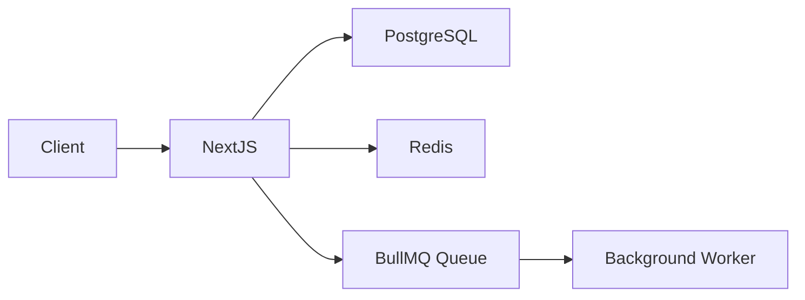

# Technology Stack — Selection & Standards

> This rule defines the **approved tech stack** for all projects. When starting a new project or proposing a new dependency, follow the decision criteria below.

---

## 🗂️ Quick Reference — Approved Stack

| Layer | Primary Choice | Alternative | Avoid |
|-------|---------------|-------------|-------|
| **Frontend Framework** | Next.js 14+ (App Router) | React + Vite | CRA (deprecated) |
| **UI Components** | shadcn/ui + Radix UI | Chakra UI | MUI (too heavy) |
| **Styling** | Tailwind CSS | CSS Modules | Styled-components (runtime cost) |
| **State Management** | Zustand | Redux Toolkit | MobX, Recoil |
| **Data Fetching** | TanStack Query (React Query) | SWR | Axios alone |
| **Backend Framework** | Express.js + Node | Fastify | Hapi, Koa |
| **API Style** | REST (default) | tRPC (fullstack TS) | GraphQL (unless needed) |
| **Language** | TypeScript (always) | — | Plain JavaScript |
| **Database** | PostgreSQL | — | MySQL (prefer PG) |
| **ORM** | Prisma | Drizzle | Sequelize, TypeORM |
| **Cache** | Redis (ioredis) | Upstash Redis | Memcached |
| **Queue** | BullMQ (Redis-backed) | — | RabbitMQ (unless existing infra) |
| **Auth** | NextAuth.js (Next) / JWT+bcrypt (API) | Lucia Auth | Firebase Auth |
| **File Storage** | AWS S3 / Cloudflare R2 | Supabase Storage | Local disk (not scalable) |
| **Email** | Resend | Nodemailer + SMTP | SendGrid (expensive) |
| **Search** | PostgreSQL FTS (start here) | Meilisearch | Elasticsearch (unless needed) |
| **Monitoring** | Grafana + Prometheus | Datadog | — |
| **Logging** | Pino | Winston | console.log (production) |
| **Testing** | Vitest + Testing Library | Jest | Mocha |
| **E2E Testing** | Playwright | Cypress | Selenium |
| **CI/CD** | GitHub Actions | — | Jenkins (legacy) |
| **Containerization** | Docker + Docker Compose | — | — |
| **Deployment** | Vercel (frontend) + Railway/Fly.io (backend) | AWS | — |
| **API Docs** | Swagger / OpenAPI 3.0 | — | Postman collections only |

---

## 🖥️ Frontend — Next.js

### When to use Next.js
- ✅ Full-stack web application with SEO requirements
- ✅ Dashboard + public-facing pages
- ✅ Server-side rendering or static generation needed
- ✅ API routes collocated with frontend

### When to use React + Vite (SPA only)
- ✅ Pure admin dashboard (no SEO needed)
- ✅ Highly interactive app (e.g., design tool, game)
- ✅ Backend is a separate service

### Project Setup
```bash
npx create-next-app@latest my-app \
  --typescript \
  --tailwind \
  --eslint \
  --app \
  --src-dir \
  --import-alias "@/*"
```

### Next.js Folder Structure (App Router)
```
src/
├── app/
│   ├── (auth)/               # Route groups
│   │   ├── login/page.tsx
│   │   └── register/page.tsx
│   ├── (dashboard)/
│   │   ├── layout.tsx
│   │   └── page.tsx
│   ├── api/                  # API Routes
│   │   └── v1/
│   │       └── users/route.ts
│   ├── layout.tsx            # Root layout
│   └── page.tsx              # Home page
├── components/
│   ├── ui/                   # shadcn/ui components
│   └── [feature]/            # Feature-specific components
├── lib/
│   ├── db.ts                 # Prisma client singleton
│   ├── redis.ts              # Redis client singleton
│   └── utils.ts
├── hooks/                    # Custom React hooks
├── stores/                   # Zustand stores
└── types/                    # TypeScript types
```

### Key Rules
- Use **Server Components** by default; add `'use client'` only when needed
- Use **Server Actions** for form submissions; avoid creating API routes just for internal use
- Co-locate components with their pages when they're not shared

---

## 🗄️ Database — PostgreSQL + Prisma

### Why PostgreSQL
- ACID compliant, battle-tested
- Excellent JSON support (`jsonb`) — avoids needing MongoDB in most cases
- Full-text search built-in
- Row-level security for multi-tenant apps
- Best ORM support (Prisma, Drizzle)

### Prisma Setup
```bash
npm install prisma @prisma/client
npx prisma init --datasource-provider postgresql
```

### Prisma Schema Conventions
```prisma
// prisma/schema.prisma

model User {
  id        String   @id @default(cuid())   // ✅ cuid() for distributed systems
  email     String   @unique
  name      String?
  role      Role     @default(USER)
  createdAt DateTime @default(now())
  updatedAt DateTime @updatedAt
  deletedAt DateTime?                        // soft delete

  orders    Order[]

  @@map("users")                             // ✅ snake_case table name
  @@index([email])
}

enum Role {
  USER
  ADMIN
}
```

### Prisma Client — Singleton Pattern
```ts
// src/lib/db.ts
import { PrismaClient } from '@prisma/client';

const globalForPrisma = global as unknown as { prisma: PrismaClient };

export const db =
  globalForPrisma.prisma ||
  new PrismaClient({
    log: process.env.NODE_ENV === 'development' ? ['query', 'error'] : ['error'],
  });

if (process.env.NODE_ENV !== 'production') globalForPrisma.prisma = db;
```

### Migration Workflow
```bash
# Development: auto-migrate
npx prisma migrate dev --name add_user_role

# Production: apply pending migrations
npx prisma migrate deploy

# View DB in browser
npx prisma studio
```

### PostgreSQL Best Practices
- Use `cuid()` or `uuid()` for primary keys (not auto-increment integers for distributed systems)
- Always add `@@index` on foreign keys and frequently queried columns
- Use `jsonb` columns for flexible/schema-less data instead of adding MongoDB
- Enable `pg_trgm` extension for fuzzy search
- Set `statement_timeout` and `lock_timeout` for long queries

---

## ⚡ Cache — Redis + ioredis

### Why Redis
- Sub-millisecond latency
- Supports strings, hashes, lists, sets, sorted sets, streams
- Built-in TTL, pub/sub, Lua scripts
- Powers caching + queues (BullMQ) + rate limiting + sessions

### Redis Client Setup
```ts
// src/lib/redis.ts
import Redis from 'ioredis';

const globalForRedis = global as unknown as { redis: Redis };

export const redis =
  globalForRedis.redis ||
  new Redis(process.env.REDIS_URL!, {
    maxRetriesPerRequest: 3,
    enableReadyCheck: true,
    lazyConnect: true,
  });

if (process.env.NODE_ENV !== 'production') globalForRedis.redis = redis;
```

### Cache Helper
```ts
// src/lib/cache.ts
import { redis } from './redis';

export async function getOrSet<T>(
  key: string,
  fetcher: () => Promise<T>,
  ttlSeconds = 3600
): Promise<T> {
  const cached = await redis.get(key);
  if (cached) return JSON.parse(cached);

  const data = await fetcher();
  await redis.setex(key, ttlSeconds, JSON.stringify(data));
  return data;
}

export async function invalidate(pattern: string) {
  const keys = await redis.keys(pattern);
  if (keys.length) await redis.del(...keys);
}
```

### Redis Key Naming → See `naming-conventions.md`
```
myapp:v1:user:123:profile    (TTL: 1h)
myapp:v1:session:abc123      (TTL: 7d)
myapp:v1:rate_limit:ip:...   (TTL: 15m)
```

### Queue with BullMQ
```ts
// src/queues/email-queue.ts
import { Queue, Worker } from 'bullmq';
import { redis } from '@/lib/redis';

export const emailQueue = new Queue('email', { connection: redis });

// Add job
await emailQueue.add('send-welcome', { to: user.email, name: user.name });

// Worker (separate process)
const worker = new Worker('email', async (job) => {
  await sendEmail(job.data);
}, { connection: redis });
```

---

## 📄 Documentation

### API Documentation — OpenAPI / Swagger
```bash
npm install swagger-ui-express @asteasolutions/zod-to-openapi
```

- Every API endpoint MUST have OpenAPI annotations
- Auto-generate from code (Zod schemas or JSDoc)
- Mount at `/api-docs`
- Keep `openapi.yaml` committed to repo

### Code Documentation
```ts
/**
 * Find a user by their email address.
 * @param email - The user's email (must be lowercase)
 * @returns The user object or null if not found
 * @throws {AppError} If database is unavailable
 */
async function findUserByEmail(email: string): Promise<User | null> {}
```

### README Template (mandatory for every service)
```markdown
# Service Name

## What it does (1-2 sentences)

## Tech Stack
- Runtime: Node.js 20 + TypeScript
- Framework: Next.js 14
- Database: PostgreSQL (Prisma)
- Cache: Redis

## Quick Start
\`\`\`bash
cp .env.example .env
npm install
npx prisma migrate dev
npm run dev
\`\`\`

## Environment Variables → see .env.example
## API Documentation → /api-docs
## Architecture → docs/architecture.md
```

### Architecture Diagrams (docs/architecture/)
- Use **Mermaid** for all diagrams (version-controlled, no external tools)
- Required diagrams: System context, Component diagram, Data flow, DB ERD



---

## ✅ Technology Decision Process

When **proposing a new library or technology**, evaluate against these criteria:

| Criterion | Questions to ask |
|-----------|-----------------|
| **Necessity** | Does an approved alternative already solve this? |
| **Maintenance** | Stars > 1k? Last commit < 6 months? |
| **Bundle size** | Check bundlephobia.com — is it worth the KB? |
| **TypeScript** | Does it have native TS types? |
| **License** | Is it MIT/Apache? (No GPL in commercial products) |
| **Security** | `npm audit` — zero high/critical vulnerabilities |
| **Community** | Active issues/discussions? Stack Overflow answers? |

### Decision Template
```markdown
## Technology Decision: [Library Name]

**Problem**: What problem does this solve?
**Alternative evaluated**: What from the approved stack was considered?
**Why chosen**: Specific reason this is better for the use case
**Risk**: Known downsides or migration cost
**Decision**: ✅ Adopt / ❌ Reject
```
